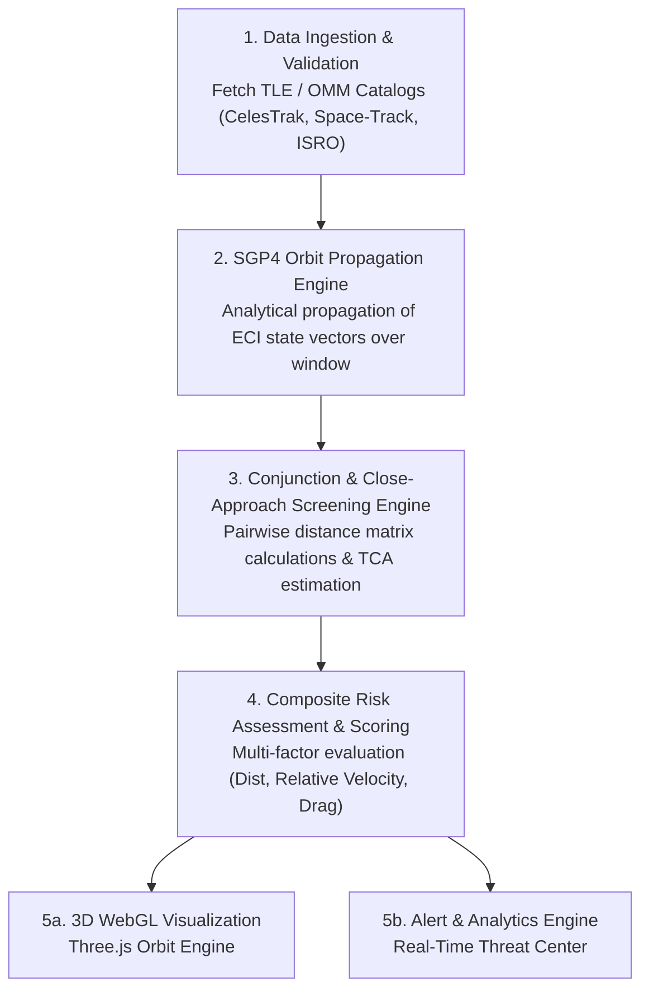
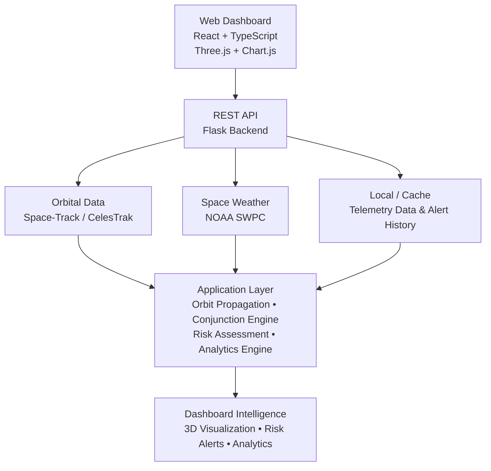

# NabhRakshak — Space Situational Awareness & Collision Risk Dashboard

> **See the Orbit. Predict the Threat. Protect the Mission.**


NabhRakshak is an advanced, web-based **Space Situational Awareness (SSA)** and orbital safety platform designed to track satellites, payloads, and space debris in real-time. By leveraging high-precision orbital mechanics algorithms, SGP4-based trajectory propagation, and multi-factor risk scoring, NabhRakshak identifies potential close-approach conjunctions long before they happen—empowering mission operators to safeguard high-value orbital assets.

The platform provides a unified operational environment combining **live Two-Line Element (TLE) data ingestion, automated conjunction screening, 3D WebGL orbit visualization, real-time alert dispatching, space-weather environmental monitoring, and historical risk analytics**.

---

## Processing Pipeline

NabhRakshak processes orbital data through a modular five-stage execution pipeline:



The pipeline operates continuously, continuously refreshing orbital element sets, computing short-term and medium-term orbital ephemerides, and flagging high-risk conjunction events across Low Earth Orbit (LEO), Medium Earth Orbit (MEO), and Geostationary Orbit (GEO).

---

## Key Features

### Live Orbital Tracking & Catalog Ingestion
- **Automated Catalog Synchronization**: Ingests publicly available Two-Line Element (TLE) and Orbit Mean-Element Message (OMM) datasets directly from CelesTrak, Space-Track, and ISRO mission catalogs.
- **Categorized Asset Management**: Differentiates active satellites, defunct payloads, upper-stage rocket bodies, and tracked space debris fragments.
- **Real-Time Telemetry Breakdown**: Extracts key orbital elements including inclination ($i$), right ascension of ascending node ($\Omega$), eccentricity ($e$), argument of perigee ($\omega$), mean anomaly ($M$), and mean motion ($n$).

### High-Precision Orbital Propagation
- **SGP4 Analytical Model**: Implements simplified perturbations models (SGP4/SDP4) to calculate satellite state vectors (position $\mathbf{r}$ and velocity $\mathbf{v}$) in the Earth-Centered Inertial (ECI) coordinate frame.
- **Perturbation Accounting**: Factors in Earth oblateness ($J_2, J_3, J_4$), atmospheric drag (Bstar drag term), and gravitational harmonics over flexible propagation windows (24h to 72h).
- **Ephemeris Generation**: Generates discretized 3D position trajectories for smooth line rendering and collision screening.

### Conjunction & Close-Approach Screening
- **Pairwise Distance Screening**: Continuously evaluates relative separation distances $\Delta r = \|\mathbf{r}_A(t) - \mathbf{r}_B(t)\|$ between all active assets and nearby space debris objects.
- **Time of Closest Approach (TCA)**: Pinpoints the exact timestamp when relative distance reaches its local minimum.
- **Miss Distance Estimation**: Computes total miss distance along with radial, in-track, and cross-track component vectors (RIC frame).

### Composite Collision Risk Scoring
- **Algorithmic Threat Evaluation**: Combines absolute miss distance, relative velocity at TCA, altitude regime, and object characteristics into a normalized 0–100 risk index.
- **Severity Classification**: Categorizes detected conjunctions into distinct operational threat tiers:
  - **Critical Risk** ($\text{Risk} \ge 75$): Immediate close-approach threat; maneuver planning required.
  - **Warning / Elevated** ($40 \le \text{Risk} < 75$): Close proximity detected; heightened monitoring enabled.
  - **Low / Nominal** ($\text{Risk} < 40$): Standard orbital passage within safe margins.

### Interactive 3D WebGL Space Visualization
- **Hardware-Accelerated Globe**: Rendered with Three.js featuring atmospheric scattering, high-resolution Earth textures, day/night terminator boundaries, and starfield particle systems.
- **Dynamic Orbit Rendering**: Visualizes 3D orbital trajectories with color-coded risk paths (high-risk objects highlighted in vibrant red/orange).
- **Interactive Inspection**: Clickable satellite nodes with real-time status popups, orbital element cards, and trajectory toggles.

### Real-Time Conjunction Alerts & Intelligence
- **Threat Notification Center**: Live alerting system displaying active conjunction pairs ordered by urgency and TCA countdown.
- **Mission Dashboard Modals**: Deep-dive operational view showing time-to-encounter, closing speed, relative position vectors, and object metadata.
- **Filterable Event List**: Filter conjunction events by object type, risk score threshold, and time window.

### Space Weather Environmental Context
- **Solar & Geomagnetic Monitoring**: Displays live X-ray solar flare flux, geomagnetic Kp-index, and solar wind conditions fetched from NOAA Space Weather Prediction Center (SWPC).
- **Atmospheric Drag Contextualization**: Assesses geomagnetic storm activity (Kp $\ge 5$) which induces upper-atmosphere expansion and increases low-altitude orbital drag uncertainty.

### Historical Analytics & Trend Inspection
- **Interactive Data Charts**: Powered by Chart.js (`react-chartjs-2`), providing 24–72 hour predicted Kp index bar charts, historical storm vs. flare trends, and satellite downtime correlations.
- **Fleet Statistics**: Summary metrics tracking total monitored objects, active conjunction warnings, average daily miss distances, and risk distribution breakdown.

---

## Technical Architecture



### Component Breakdown

| Layer | Technology | Primary Function |
|---|---|---|
| **Presentation Layer** | React 18, TypeScript, Tailwind CSS, Framer Motion | User interface, modal dialogs, tab management, responsive layouts |
| **Graphics & Charts** | Three.js, Canvas 2D, Chart.js (`react-chartjs-2`) | 3D interactive planetarium, orbit paths, space weather trend charts |
| **API Layer** | Flask, Python 3, Flask-CORS | REST endpoints for orbital catalog, telemetry queries, and background tasks |
| **Computation Engine** | Python SGP4, NumPy, Math Utilities | Analytical orbit propagation, pairwise distance evaluation, TCA solver |
| **Data Ingestion** | Requests, Custom Parsers | Scheduled fetchers for CelesTrak TLEs, ISRO satellite catalogs, and NOAA SWPC JSON |

---

## Technology Stack

### Frontend Core
- **Framework:** React 18 & TypeScript
- **Build System:** Vite (Fast HMR & ESM bundling)
- **Styling:** Tailwind CSS (Utility-first dark space theme)
- **Routing:** React Router DOM with `HashRouter` (Client-side routing immune to static host 404 refresh errors)
- **3D Engine:** Three.js (Custom shaders, 3D meshes, particle starfields, Earth planetarium)
- **Data Visualization:** Chart.js & `react-chartjs-2` (Space weather & orbital trend charts)
- **UI Animations & Icons:** Framer Motion & Lucide React / Heroicons

### Backend Core
- **Server Framework:** Python 3 & Flask (REST API endpoints)
- **CORS Handling:** Flask-CORS (Cross-Origin Resource Sharing)
- **Mathematics & Celestial Mechanics:** Python `sgp4` library, NumPy vector mathematics, WGS84 coordinate transformations
- **Scheduler:** Background threading & cached telemetry stores

### External Data Interfaces
- **CelesTrak API**: Active satellite, debris, and special interest orbital element sets
- **Space-Track.org**: Satellite catalog numbers, international designators, and historical TLEs
- **ISRO Telemetries**: Supplemental Indian satellite orbital parameters
- **NOAA SWPC API**: Solar X-ray flux, solar proton flux, and planetary Kp-index forecasts

---

## System Workflow

1. **Catalog Ingestion & Validation**  
   The backend retrieves Two-Line Element (TLE) sets from external providers. The data is parsed, verified for epoch currency, and normalized into structured JSON models.

2. **SGP4 Trajectory Propagation**  
   For each satellite object, the SGP4 algorithm converts TLE orbital elements into position ($\mathbf{r} = [x, y, z]^T$) and velocity ($\mathbf{v} = [v_x, v_y, v_z]^T$) vectors in the ECI frame across discretized time steps.

3. **Pairwise Conjunction Screening**  
   The conjunction engine iterates through pairs of primary assets and secondary space debris objects. It evaluates relative distance $\Delta r(t) = \|\mathbf{r}_A(t) - \mathbf{r}_B(t)\|$ to isolate local minima representing close approach events.

4. **Risk Quantification & Alert Generation**  
   Conjunction events within screening radii are evaluated by the risk scoring module. Events exceeding safety thresholds trigger alert payloads specifying the object pair, TCA, miss distance, relative velocity, and assigned risk tier.

5. **3D WebGL Rendering & User Interaction**  
   The React frontend fetches propagated coordinates and renders the Earth, satellite nodes, and dynamic orbit trajectories on a 60 FPS Three.js canvas. Users can filter events, inspect individual objects, and view space-weather forecasts.

---

## Dashboard Modules

| Module | Technical Capabilities |
|---|---|
| **Mission Overview** | High-level operations center showcasing total monitored objects, active high-risk conjunction alerts, space-weather summary cards, and quick navigation. |
| **3D Orbital View** | Full-screen interactive 3D WebGL globe rendering Earth, satellite meshes, debris fields, trajectory paths, and orbital layer controls. |
| **Conjunction Monitor** | Dedicated threat screening table listing close-approach pairs, TCA countdowns, miss distances, closing speeds, and severity badges. |
| **Satellite Intelligence** | Searchable orbital asset catalog with status filtering (Active, High Risk, Inactive), orbital parameters ($i, e, a, \Omega$), and detailed telemetry modals. |
| **Space Weather** | Environmental monitoring suite with live solar flare X-ray flux, geomagnetic Kp-index gauge, 24-72h predicted storm levels, and historical impact analytics. |
| **Simulation & Sandbox** | Interactive orbital simulation tool allowing custom parameter adjustments and trajectory scenario testing. |

---

## Technical Limitations

NabhRakshak is a technology demonstration prototype designed to illustrate modern web-based approaches to Space Situational Awareness and orbital risk monitoring. It is **not** a flight-qualified collision avoidance platform.

- **Data Epoch Currency**: Orbital prediction accuracy is bound by the age and frequency of public TLE updates. Fresh TLEs are required for accurate short-term propagation.
- **SGP4 Analytical Model**: SGP4 relies on simplified perturbation equations. Unmodeled satellite maneuvers, solar radiation pressure spikes, and complex atmospheric drag fluctuations introduce position error over multi-day propagation windows.
- **Covariance Representation**: The prototype risk scoring algorithm uses deterministic separation distance and closing velocity screening. Operational satellite conjunction assessment requires full 3D error covariance matrices ($3\times3$ positional uncertainty ellipsoids) to compute absolute collision probability ($P_c$).

---

## Project Structure

```text
NabhRakshak/
│
├── frontend/
│   ├── src/
│   │   ├── components/
│   │   │   ├── Common/          # Galaxy WebGL, LoadingScreen, Navigation
│   │   │   ├── Dashboard/       # ObjectList, AlertCards, Telemetry Modals
│   │   │   └── Orbit/           # 3D Globe components & Three.js canvas
│   │   │
│   │   ├── pages/
│   │   │   ├── CombinedDashboard.tsx  # Overview page
│   │   │   ├── Visualization3D.tsx    # 3D Globe view
│   │   │   ├── Satellites.tsx         # Satellite catalog page
│   │   │   ├── Alerts.tsx             # Conjunction monitoring page
│   │   │   ├── SpaceWeather.tsx       # Space weather analytics page
│   │   │   ├── Architecture.tsx       # System documentation page
│   │   │   └── Simulation.tsx         # Orbital sandbox
│   │   │
│   │   ├── services/            # REST API client bindings & fallback data
│   │   ├── utils/               # Chart.js registered configs & orbit math
│   │   ├── App.tsx              # React Router view switcher
│   │   └── main.tsx             # HashRouter entry point
│   │
│   ├── public/                  # Textures, logos, and static assets
│   ├── package.json
│   └── vite.config.ts
│
├── backend/
│   ├── app.py                   # Flask REST API server & endpoints
│   ├── config.py                # System thresholds, constants & API keys
│   ├── requirements.txt         # Python dependencies (Flask, Flask-CORS, sgp4)
│   └── data/                    # TLE cache & telemetry JSON files
│
├── public/                      # Screenshot assets & documentation images
│   └── 3d-space.png
│
├── vercel.json                  # Vercel deployment configuration
└── README.md                    # Project documentation
```

---

## Getting Started

### Prerequisites
- **Node.js**: v18.0.0 or higher
- **npm**: v9.0.0 or higher
- **Python**: v3.9 or higher
- **Git**: Installed on system
- **Web Browser**: Chrome, Firefox, Edge, or Safari with WebGL 2.0 enabled

### 1. Clone the Repository

```bash
git clone https://github.com/Ri1tik/NabhRakshak.git
cd NabhRakshak
```

### 2. Start the Backend API Server

```bash
cd backend

# Create a virtual environment (recommended)
python -m venv venv

# Activate virtual environment
# On Windows (PowerShell):
venv\Scripts\activate

# On Linux / macOS:
source venv/bin/activate

# Install Python dependencies
pip install -r requirements.txt

# Launch the Flask server
python app.py
```

The REST API will initialize on `http://localhost:5001`.

### 3. Start the Frontend Application

Open a second terminal window:

```bash
cd NabhRakshak/frontend

# Install Node dependencies
npm install

# Launch Vite development server
npm run dev
```

Open your browser to `http://localhost:5173/` (or the URL output by Vite) to explore NabhRakshak!

---

## Contributing

Contributions, issues, and feature requests are welcome! Feel free to check the [repository](https://github.com/Ri1tik/NabhRakshak) and submit pull requests.

1. Clone the Repository (`git clone https://github.com/Ri1tik/NabhRakshak.git`)
2. Create your Feature Branch (`git checkout -b feature/AmazingFeature`)
3. Commit your Changes (`git commit -m 'Add some AmazingFeature'`)
4. Push to the Branch (`git push origin feature/AmazingFeature`)
5. Open a Pull Request on the [repository](https://github.com/Ri1tik/NabhRakshak)

---

## References & Data Credits

- **CelesTrak** — Primary source for Two-Line Element (TLE) sets and satellite catalog data
- **Space-Track.org** — Official U.S. Space Force satellite catalog and orbital data provider
- **NOAA Space Weather Prediction Center (SWPC)** — Real-time solar activity, solar wind, and geomagnetic indices
- **ISRO (Indian Space Research Organisation)** — Satellite telemetry references
- **SGP4 Algorithm (Hoots & Roehrich, 1980)** — Simplified Perturbations Models for satellite propagation
- **NASA Spacecraft Conjunction Assessment and Collision Avoidance Best Practices Handbook**
- **NASA CARA** — Conjunction Assessment and Risk Analysis technical papers
- **NASA-STD-8719.14** — Process for Limiting Orbital Debris

---

## Project Status

**Status:** Working Prototype & Active Development

NabhRakshak is actively maintained. Current development focuses on refining real-time WebGL rendering performance, expanding automated TLE ingestion schedules, enhancing space-weather impact models, and implementing advanced orbital maneuver trade studies.

---
